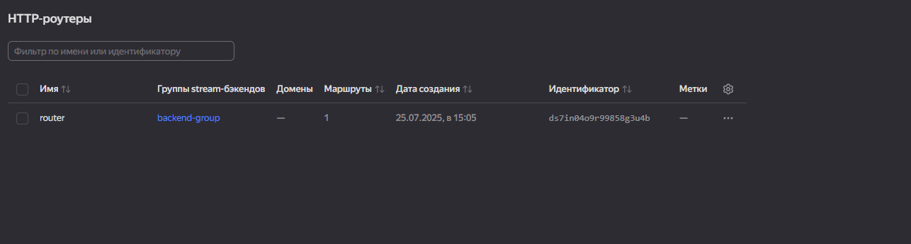
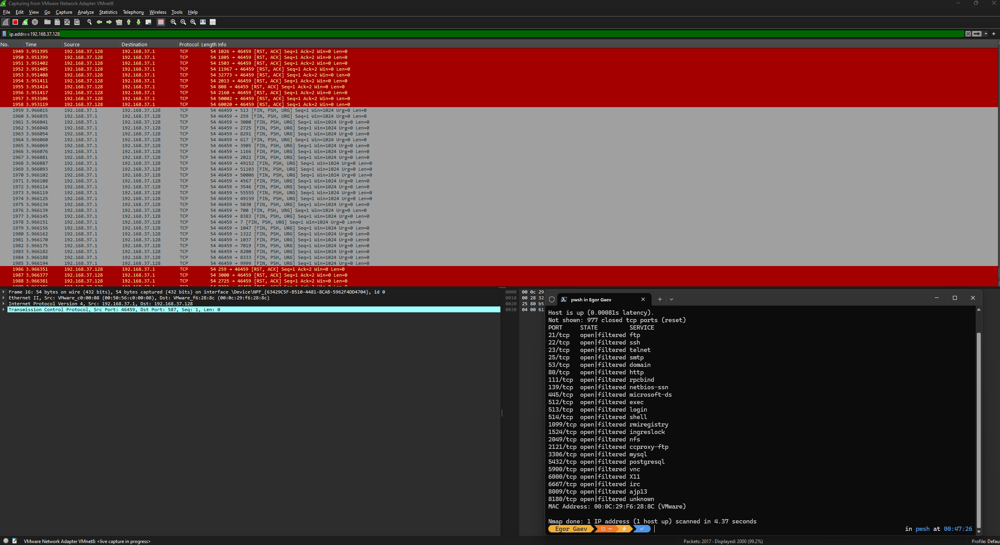
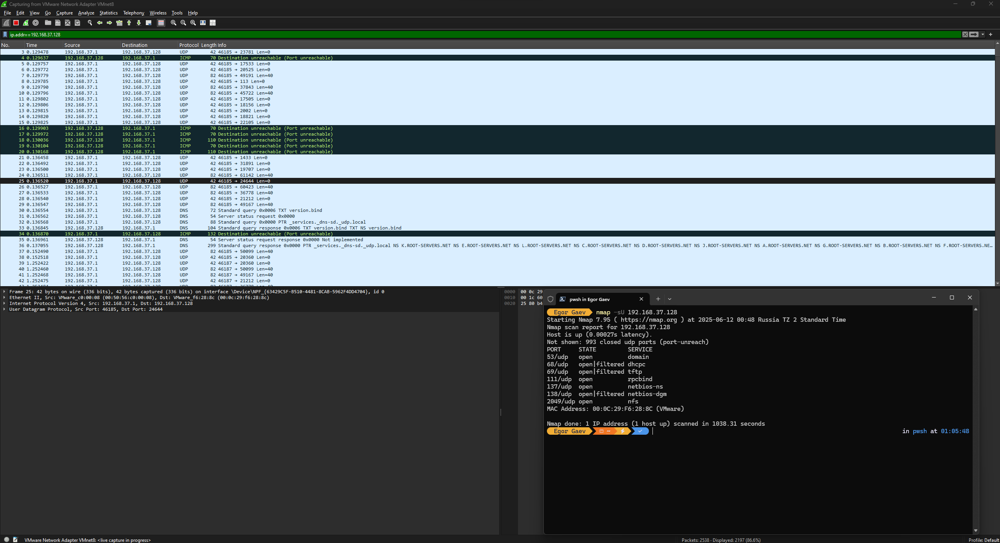

[🔙 на главную](https://github.com/YeezyWhy/netology-homework/tree/main)

# Домашнее задание по теме "Уязвимости и атаки на информационные системы". Гаев Егор

## Задание 1

Скачайте и установите виртуальную машину Metasploitable: https://sourceforge.net/projects/metasploitable/.

Это типовая ОС для экспериментов в области информационной безопасности, с которой следует начать при анализе уязвимостей.

Просканируйте эту виртуальную машину, используя **nmap**.

Попробуйте найти уязвимости, которым подвержена эта виртуальная машина.

Сами уязвимости можно поискать на сайте https://www.exploit-db.com/.

Для этого нужно в поиске ввести название сетевой службы, обнаруженной на атакуемой машине, и выбрать подходящие по версии уязвимости.

Ответьте на следующие вопросы:

- Какие сетевые службы в ней разрешены?
- Какие уязвимости были вами обнаружены? (список со ссылками: достаточно трёх уязвимостей)
  
*Приведите ответ в свободной форме.*

## Решение

Список уязвимостей:

* [vsftpd 2.3.4 - Backdoor Command Execution](https://www.exploit-db.com/exploits/49757)
* [Oracle MySQL < 5.1.49 - 'DDL' Statements Denial of Service](https://www.exploit-db.com/exploits/34522)
* [PostgreSQL 8.3.6 - Conversion Encoding Remote Denial of Service](https://www.exploit-db.com/exploits/32849)

### Задание 2

Проведите сканирование Metasploitable в режимах SYN, FIN, Xmas, UDP.

Запишите сеансы сканирования в Wireshark.

Ответьте на следующие вопросы:

- Чем отличаются эти режимы сканирования с точки зрения сетевого трафика?
- Как отвечает сервер?

*Приведите ответ в свободной форме.*

## Решение

* SYN scan (-sS):

Отправляется TCP-пакет с флагом SYN (установка соединения).
* Если порт открыт — сервер отвечает SYN+ACK.
* Если порт закрыт — сервер отвечает RST.

Клиент не завершает соединение (не отправляет ACK), а сразу посылает RST, чтобы не устанавливать лноценное соединение.

Трафик минимален, сканирование быстрое и скрытное.

* FIN scan (-sF):

Отправляется TCP-пакет с установленным флагом FIN (завершение соединения).
* Если порт закрыт — сервер отвечает RST.
* Если порт открыт — сервер не отвечает (пакет игнорируется).

Используется для обхода некоторых брандмауэров и систем обнаружения.

* Xmas scan (-sX):

Отправляется TCP-пакет с установленными флагами FIN, PSH и URG (пакет «рождественская елка»).

Логика ответа такая же, как у FIN скана:
* Закрытый порт — RST.
* Открытый порт — без ответа.

Может обойти некоторые фильтры.

* UDP scan (-sU):

Отправляются UDP-пакеты на целевые порты.

* Если порт закрыт — сервер отвечает ICMP сообщением "порт недоступен" (ICMP type 3 code 3).
* Если порт открыт — обычно нет ответа (UDP без подтверждения).

Сканирование медленнее из-за отсутствия подтверждений и возможных ICMP ограничений.

Ответы сервера:

**SYN scan:**

* Открытые порты — SYN+ACK.
* Закрытые порты — RST.

**FIN/Xmas scan:**

* Открытые порты — нет ответа.
* Закрытые порты — RST.

**UDP scan:**

* Открытые порты — обычно нет ответа.
* Закрытые порты — ICMP Port Unreachable.
