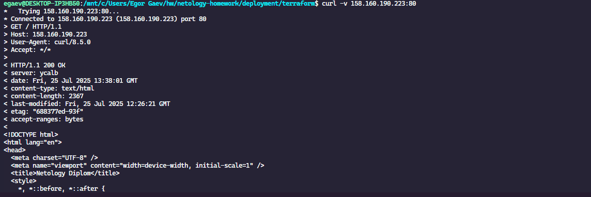
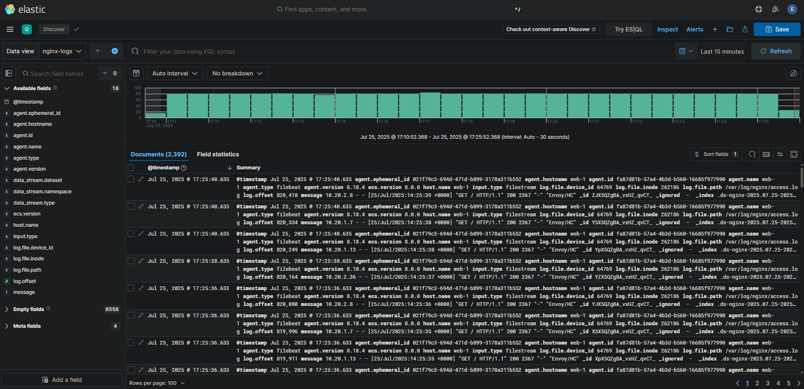
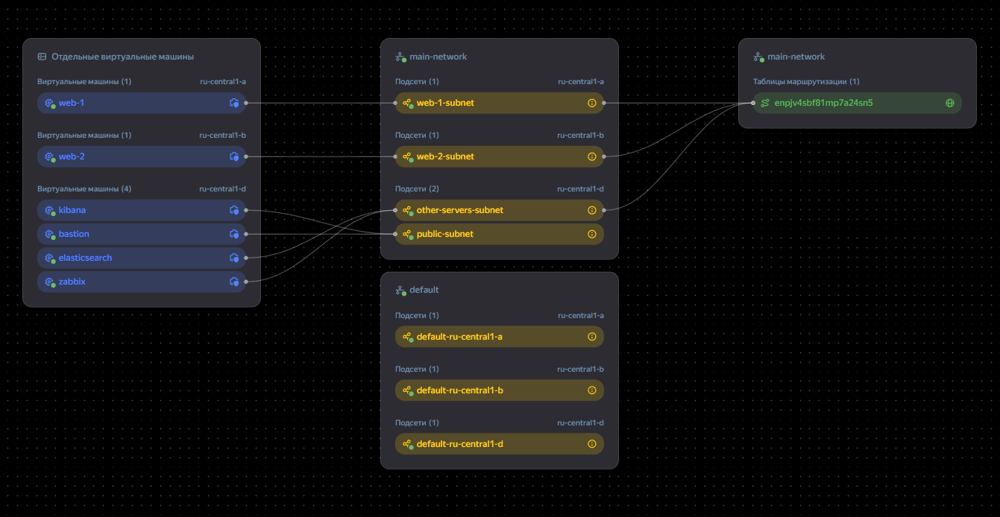
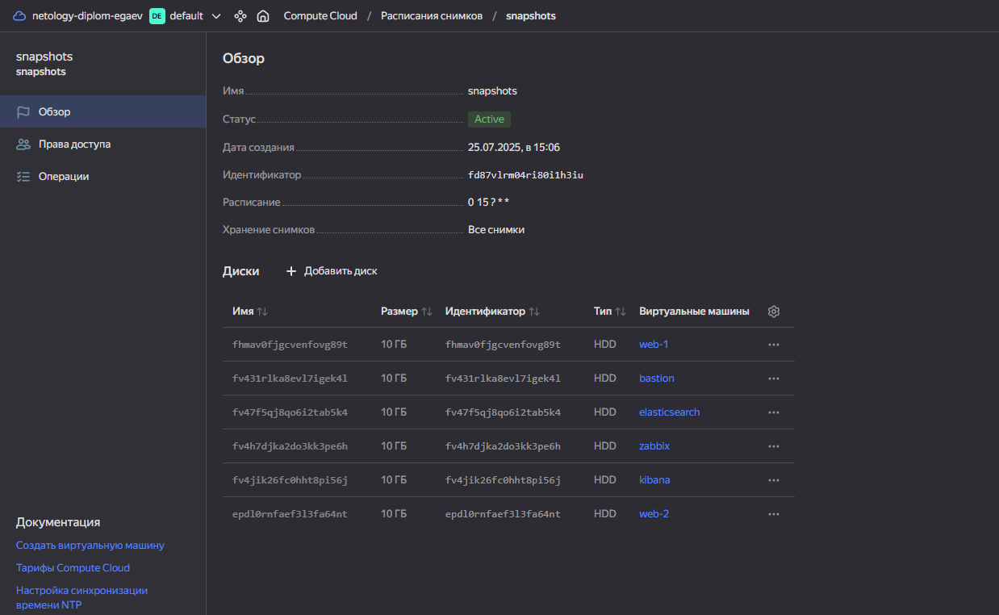

[🔙 на главную](https://github.com/JoePeach88/netology-homework/tree/main)

# Дипломная работа по профессии «Системный администратор». Гаев Егор

## Структура в Git проекте

Все файлы для деплоя инфры и сервисов через Ansible располагаются здесь:

* [Ansible](./deployment/ansible/)
* [Terraform](./deployment/terraform/)

[Ручка](./deploy.sh) для деплоя и настройки инфраструктуры

## Ресурсы доступные извне

* [Zabbix](http://158.160.190.151:8080/zabbix.php?action=dashboard.view&dashboardid=1&from=now-30m&to=now&page=2) 

* [Kibana](http://84.201.147.61:5601/app/discover#/?_g=(filters:!(),refreshInterval:(pause:!t,value:60000),time:(from:now-15m,to:now))&_a=(columns:!(),dataSource:(dataViewId:'7531fa3c-1d19-4b87-90bc-9cf231d6663d',type:dataView),filters:!(),interval:auto,query:(language:kuery,query:''),sort:!(!('@timestamp',desc))))

* [Сайт](http://158.160.190.223/)

## Инфраструктура

Были подняты 6 ВМ

## Сайт

Настроен ALB, созданы SG, TG, router и BG

Протестируйте сайт
`curl -v <публичный IP балансера>:80`

## Мониторинг

## Логи

## Сеть

## Резервное копирование

## Доступы к ресурсам

Доступы приложу к переписке
