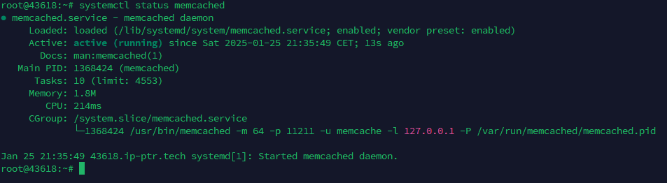
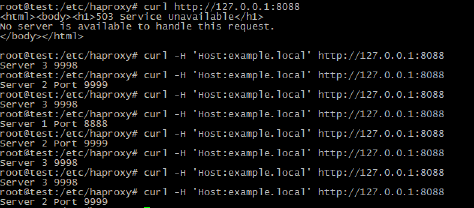
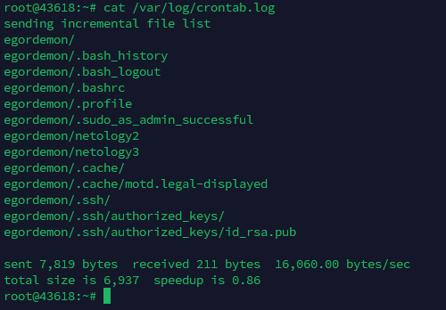
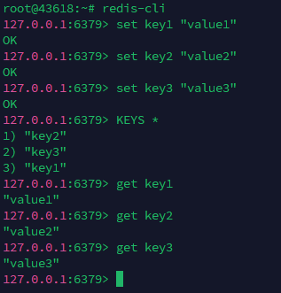

# Домашнее задачение по теме "Кеширование Redis/memcached". Гаев Егор

## Задание 1. Кеширование 

Приведите примеры проблем, которые может решить кеширование. 

*Приведите ответ в свободной форме.*

## Решение

- Ускорение доступа к данным - позволяет избежать повторных запросов к базе данных.
- Снижение нагрузки на базу данных - позволяет хранить результаты часто выполняемых запросов, что снижает количество обращений к базе данных
- Обработка больших объемов трафика - позволяет быстро обслуживать запросы без необходимости генерации страниц на лету или обращения к базе данных

## Задание 2. Memcached

Установите и запустите memcached.

*Приведите скриншот systemctl status memcached, где будет видно, что memcached запущен.*

## Решение

## Задание 3. Удаление по TTL в Memcached

Запишите в memcached несколько ключей с любыми именами и значениями, для которых выставлен TTL 5. 

*Приведите скриншот, на котором видно, что спустя 5 секунд ключи удалились из базы.*

## Решение

## Задание 4. Запись данных в Redis

Запишите в Redis несколько ключей с любыми именами и значениями. 

*Через redis-cli достаньте все записанные ключи и значения из базы, приведите скриншот этой операции.*

## Решение
