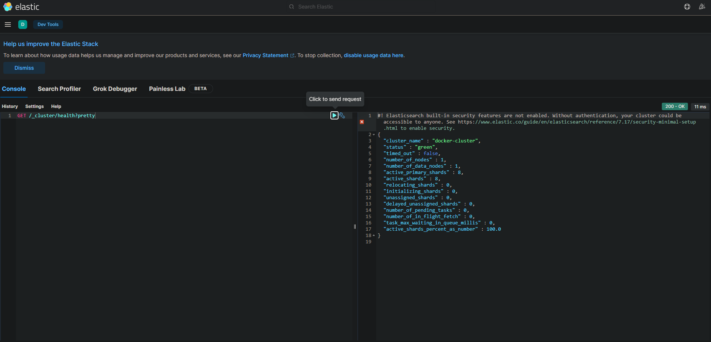

[🔙 на главную](https://github.com/YeezyWhy/netology-homework/tree/main)

# Домашнее задание по теме "Резервное копирование". Гаев Егор

## Задание 1
- Составьте команду rsync, которая позволяет создавать зеркальную копию домашней директории пользователя в директорию `/tmp/backup`
- Необходимо исключить из синхронизации все директории, начинающиеся с точки (скрытые)
- Необходимо сделать так, чтобы rsync подсчитывал хэш-суммы для всех файлов, даже если их время модификации и размер идентичны в источнике и приемнике.
- На проверку направить скриншот с командой и результатом ее выполнения


## Решение
Команда для бэкапа будете следующей

```bash
rsync -a --exclude '.*' хомяк_пользователя /tmp/backup
```


## Задание 2
- Написать скрипт и настроить задачу на регулярное резервное копирование домашней директории пользователя с помощью rsync и cron.
- Резервная копия должна быть полностью зеркальной
- Резервная копия должна создаваться раз в день, в системном логе должна появляться запись об успешном или неуспешном выполнении операции
- Резервная копия размещается локально, в директории `/tmp/backup`
- На проверку направить файл crontab и скриншот с результатом работы утилиты.


## Решение

```bash
rsync -av --delete хомяк_пользователя /tmp/backup >> /var/log/crontab.log
```


